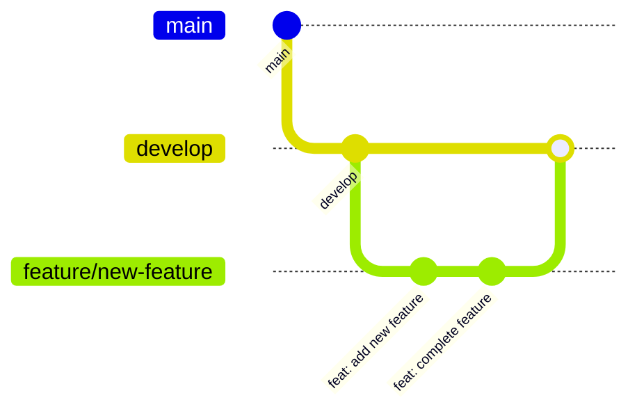
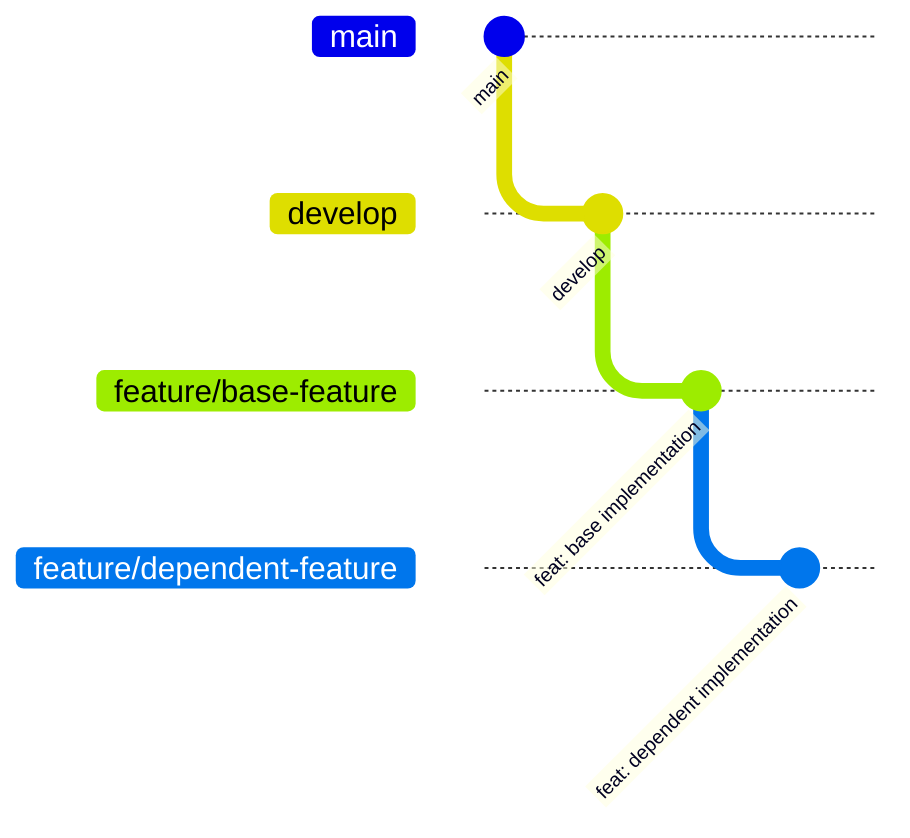

# Git ルール

このプロジェクトでは **Git Flow** をベースとしたブランチ戦略を採用しています。

## ブランチ構成

| ブランチ | 用途 |
|---------|------|
| `main` | 本番環境用。リリース済みの安定したコード |
| `develop` | 開発用。次回リリースに向けた統合ブランチ |
| `feature/*` | 新機能開発用 |
| `release/*` | リリース準備用 |
| `hotfix/*` | 本番環境の緊急バグ修正用 |

## ブランチ命名規則

```
feature/<issue番号>-<機能名>
release/vX.X.X
hotfix/<修正内容>
```

### 例
- `feature/3-fastlane-setup`
- `feature/10-camera-filter`
- `release/v1.0.0`
- `hotfix/shutter-sound-crash`

## ワークフロー

### 1. 新機能開発（Feature）



**基本ルール:**
- `develop` ブランチから新しい `feature/*` ブランチを作成する
- 開発完了後、`develop` ブランチへPRを作成してマージする

**例外ルール:**
- 依存関係がある機能を開発する場合で、依存先の `feature/*` ブランチがまだ `develop` にマージされていない場合に限り、その `feature/*` ブランチから新しい `feature/*` ブランチを作成することを許可する



> **注意:** この例外を使用する場合、PRの説明に依存関係を明記してください。

### 2. リリース（Release）

1. `develop` から `release/vX.X.X` ブランチを作成
2. リリース準備（バージョン更新、最終テストなど）
3. `main` と `develop` 両方にマージ
4. `main` にバージョンタグを付与

### 3. 緊急修正（Hotfix）

1. `main` から `hotfix/*` ブランチを作成
2. 修正を実施
3. `main` と `develop` 両方にマージ
4. `main` にバージョンタグを付与

## コミットメッセージ規則

[Conventional Commits](https://www.conventionalcommits.org/) に従います。

```
<type>: <description>

[optional body]

[optional footer]
```

### Type 一覧

| Type | 用途 |
|------|------|
| `feat` | 新機能の追加 |
| `fix` | バグ修正 |
| `docs` | ドキュメントのみの変更 |
| `style` | コードの意味に影響しない変更（空白、フォーマットなど） |
| `refactor` | バグ修正や機能追加を含まないコードの変更 |
| `test` | テストの追加・修正 |
| `chore` | ビルドプロセスやツールの変更 |

### 例
```
feat: Add camera filter pipeline
fix: Resolve shutter animation glitch on iPhone 15
docs: Update architecture documentation
refactor: Extract filter parameters to constants
test: Add unit tests for FilterService
chore: Update SwiftLint configuration
```

## PR（Pull Request）ルール

1. PRを作成する前に、ターゲットブランチの最新を取り込む
2. PRテンプレートに従って記載する
3. マージ後、feature ブランチは削除する
4. マージ方法は **Squash Merge** を使用する

## 注意事項

- `main` および `develop` ブランチへの直接コミットは禁止
- force push は原則禁止（自分の feature ブランチのみ許可）
- マージコンフリクトは、feature ブランチ側で解決する
